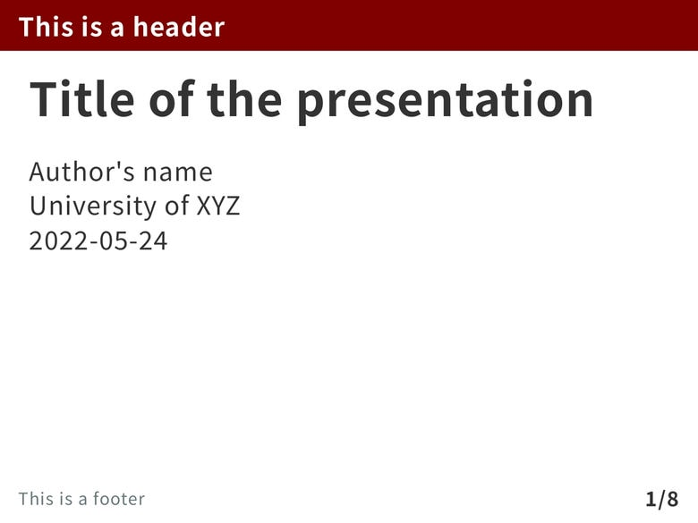
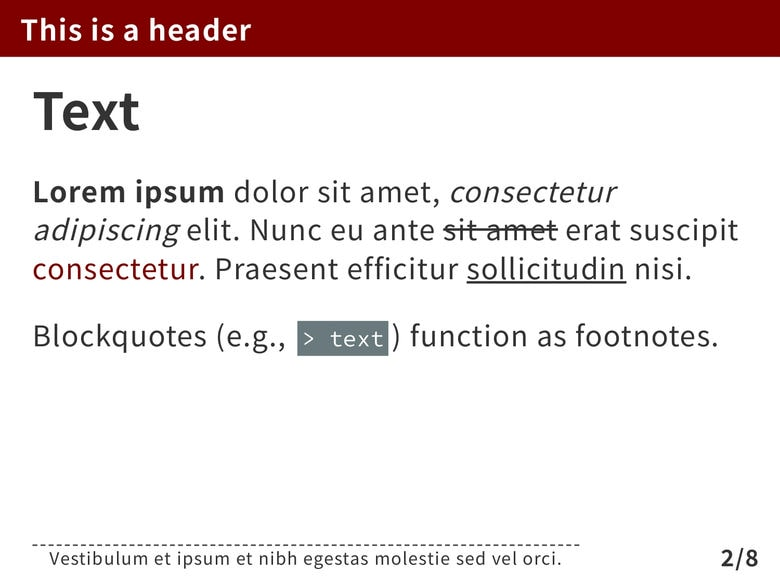
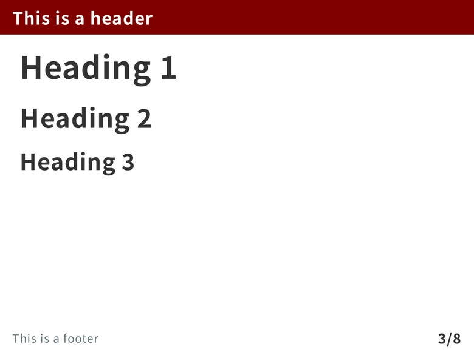
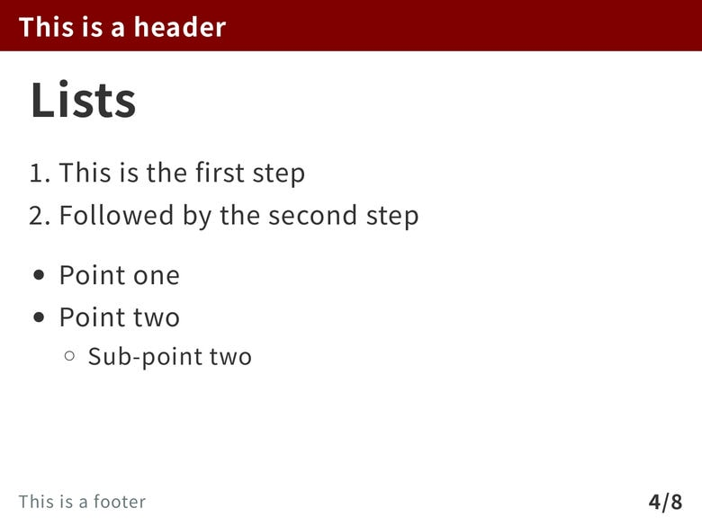
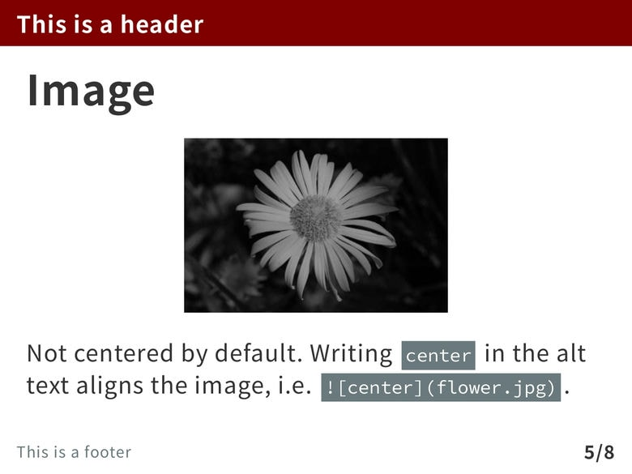
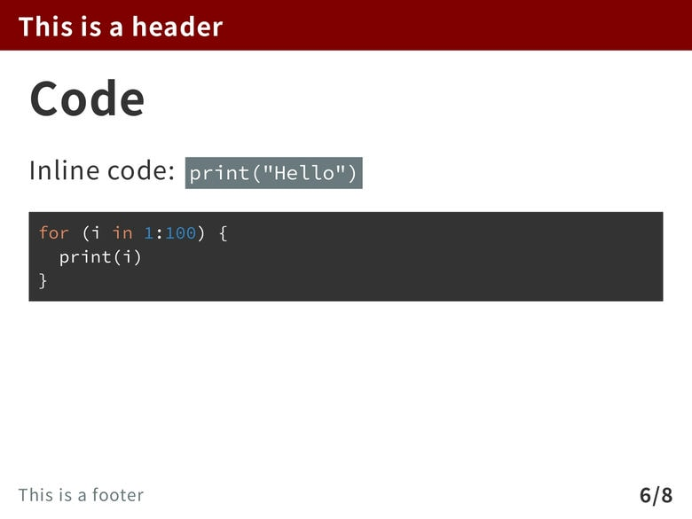
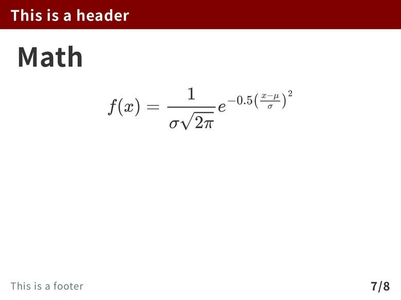
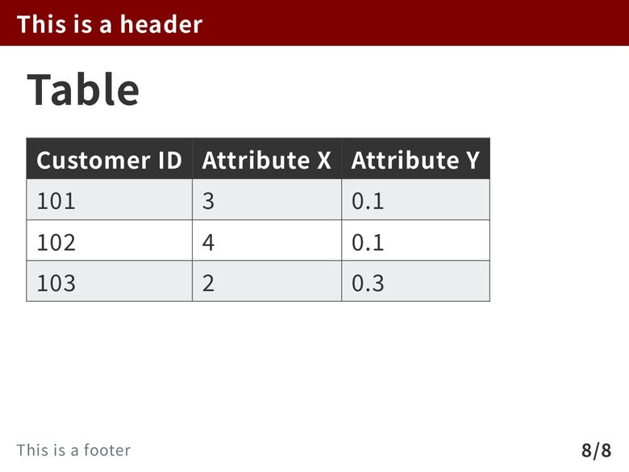

The `academic` theme features a clean design with a maroon ribbon on top. Additionally, it leverages the Markdown blockquote syntax (e.g., `> text`) to enable footnotes. The theme imports [Noto Sans](https://fonts.google.com/noto/specimen/Noto+Sans+JP/about) with support for Japanese and [Source Code Pro](https://github.com/adobe-fonts/source-code-pro).

---

If you like the `academic` theme and wish to show support to the author, please consider [starring the theme's GitHub repository](https://github.com/kaisugi/marp-theme-academic/)!

# Screenshots

# Custom classes and keywords

``

- By default, images are left-aligned.
- The `center` keywords centers the image.

Blockquotes (i.e., `> text`) are treated as footnotes.

# License

This theme is licensed under the [MIT License](https://github.com/kaisugi/marp-theme-academic/blob/main/LICENSE).