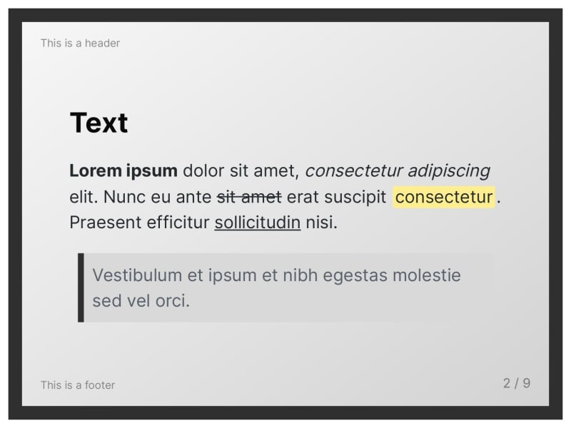
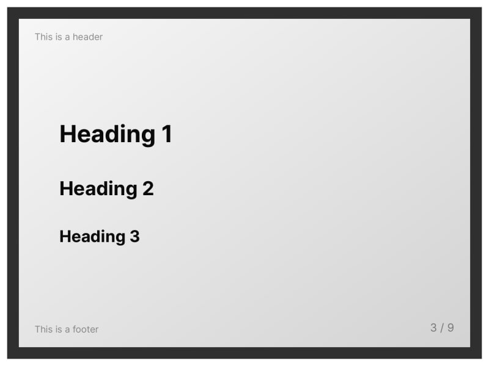
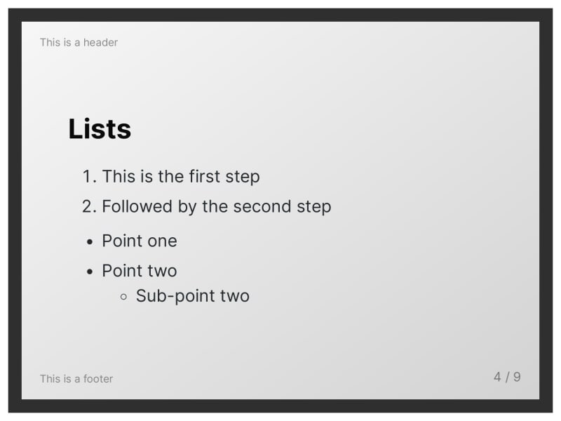
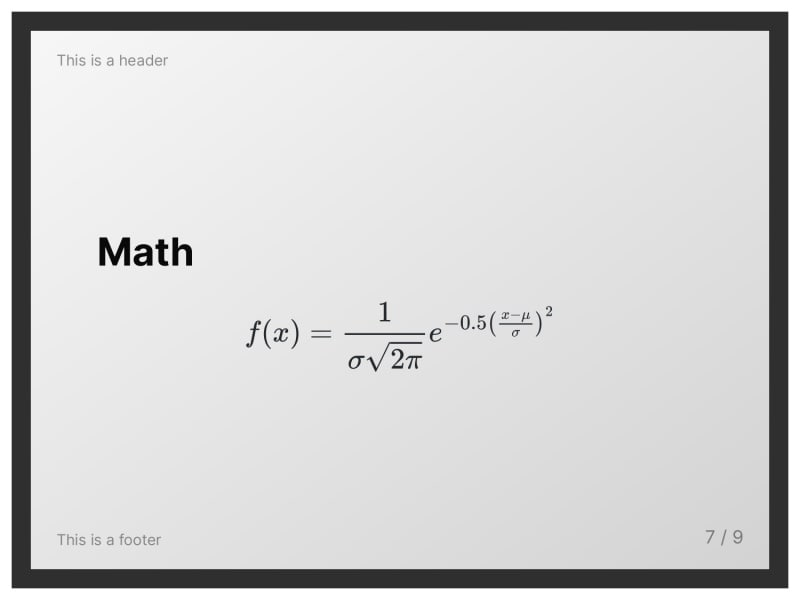
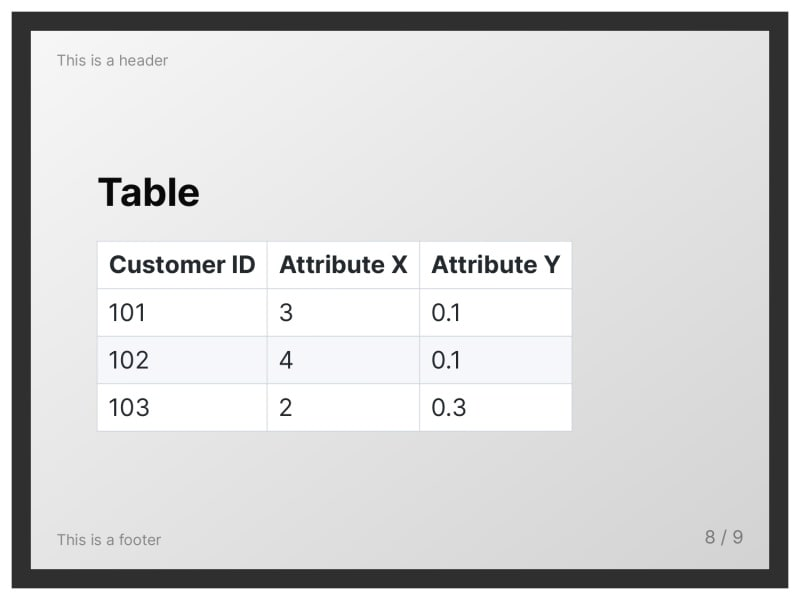

This theme is based on the `default` Marp theme but contains some notable changes. Each slide has a dark-gray border and also a white-to-gray linear gradient as its background. As the main font, the [Inter](https://github.com/rsms/inter) font family is used.

# Screenshots

# Custom classes and keywords

`<!-- _class: tinytext -->`

- Makes most text on the slide much smaller.
- Might be useful for references.

``

- By default, images are left-aligned.
- The `center` keywords centers the image.

# License

This theme is licensed under the [MIT License](https://github.com/rnd195/my-marp-themes/blob/live/LICENSE).