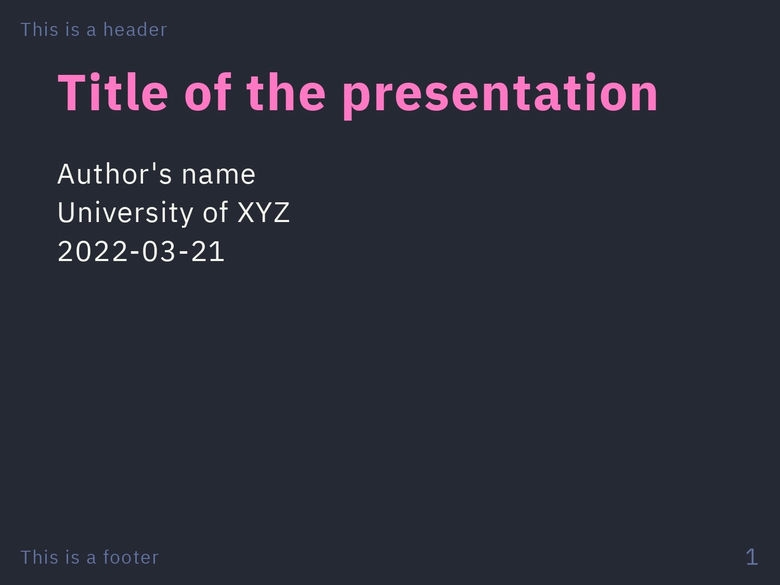
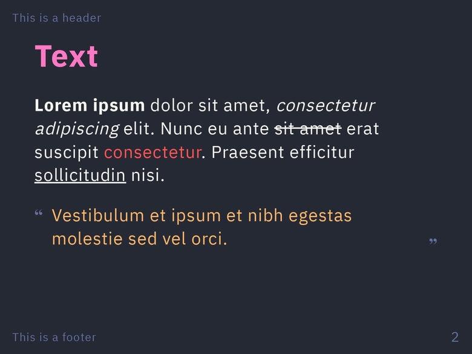
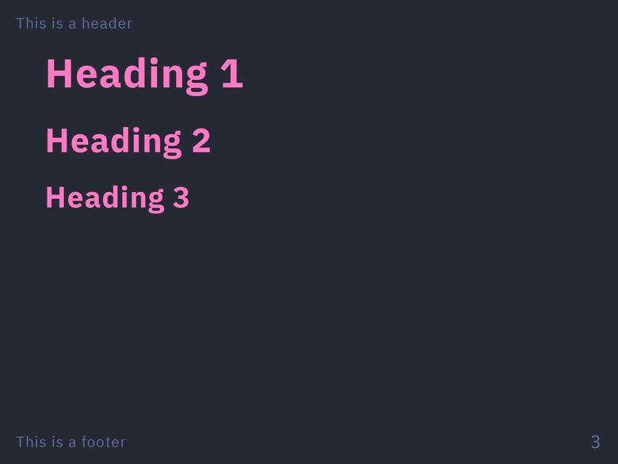
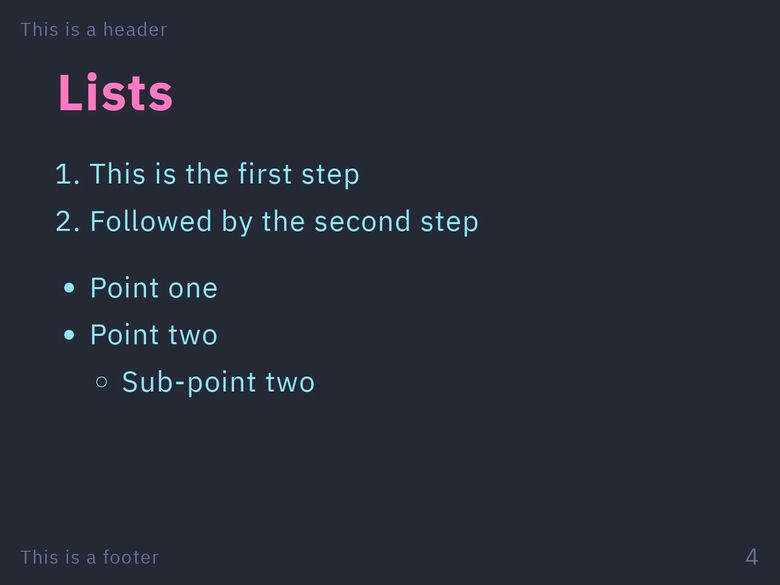
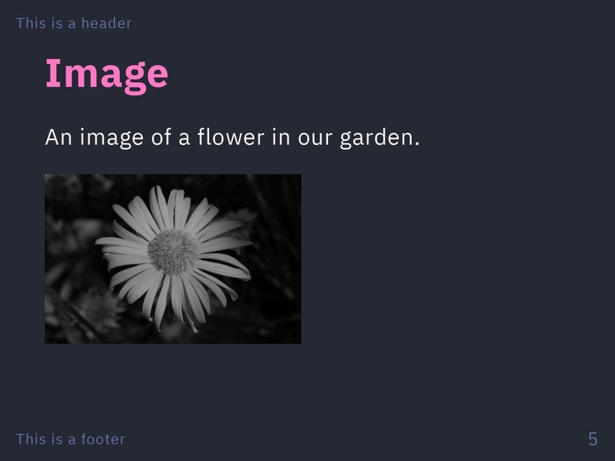
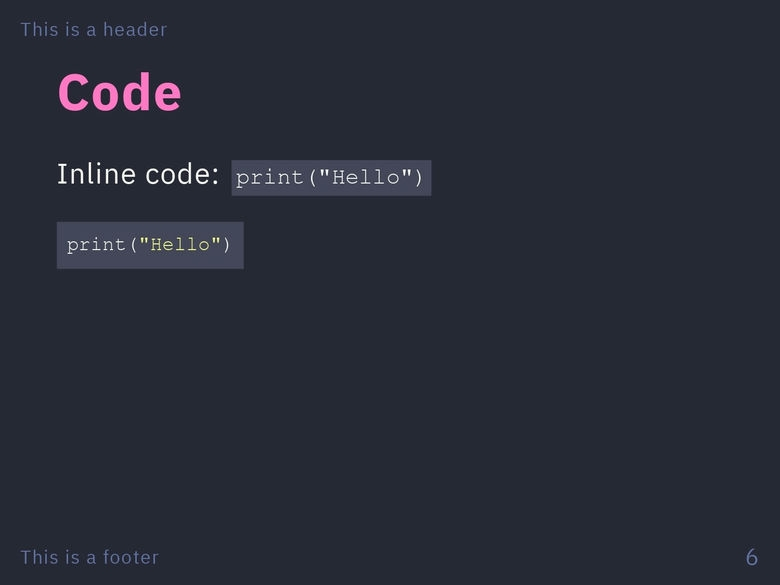
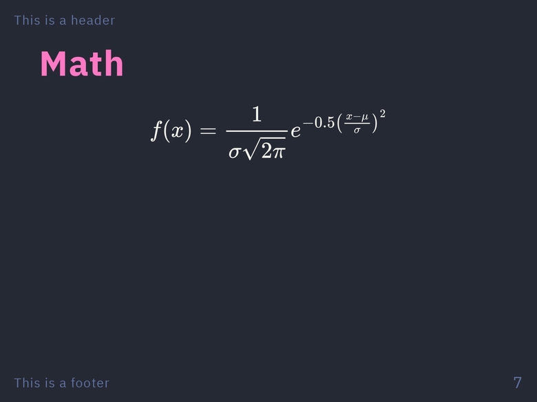
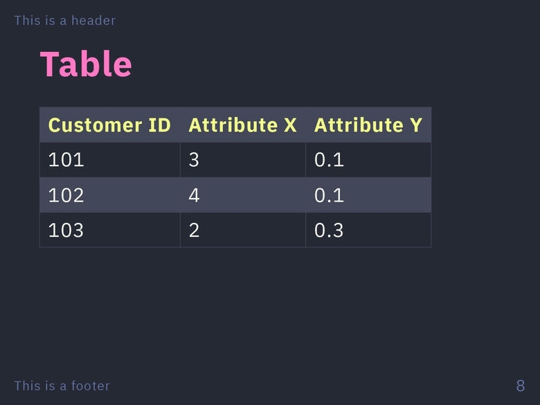

Dracula is a popular dark mode color palette for a [wide range of programs](https://draculatheme.com/). It features deep shades of purple, pink, blue, green, and black to create a visually pleasant and high-contrast aesthetic.

# Screenshots

# License

This theme is licensed under the [MIT License](https://github.com/dracula/marp/blob/master/LICENSE).