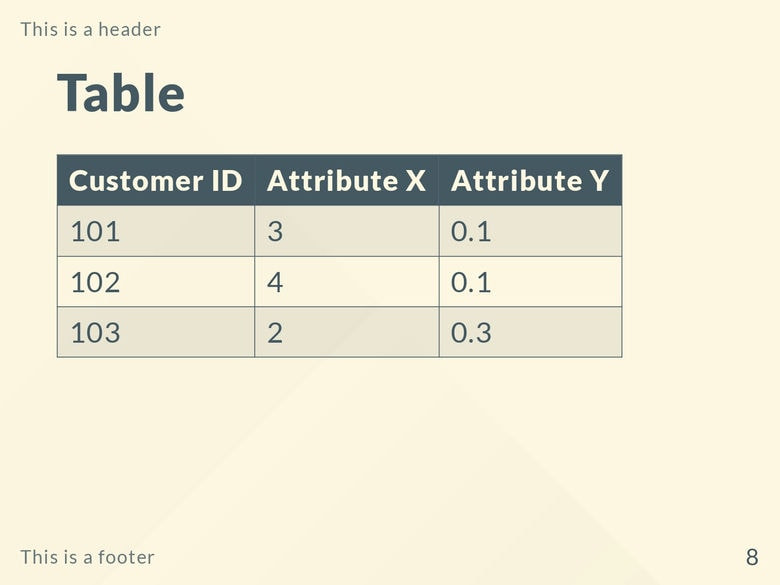

Gaia is a built-in theme in Marp featuring a minimalistic color palette of [*cornsilk*](https://www.color-name.com/hex/fff8e1) (light yellow) and [*deep space sparkle*](https://www.color-name.com/hex/455a64) (greenish grey).

If you like the `gaia` theme and wish to show support to the author(s), please consider [starring the theme's GitHub repository](https://github.com/marp-team/marp)!

# Screenshots

## `class: invert`

## `class: default`

# Custom classes and keywords

`<!-- _class: invert -->`

- Color-inverted variant of the theme.

# License

This theme is licensed under the [MIT License](https://github.com/marp-team/marp/blob/main/LICENSE).