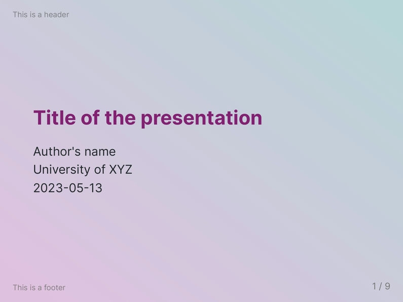
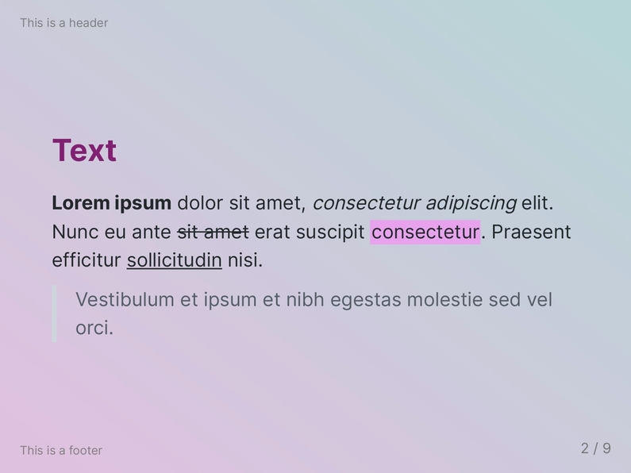
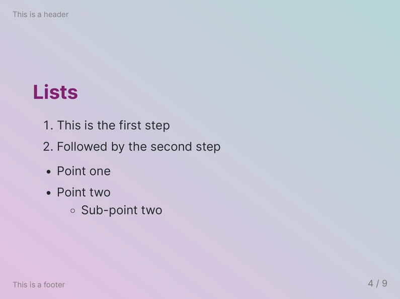
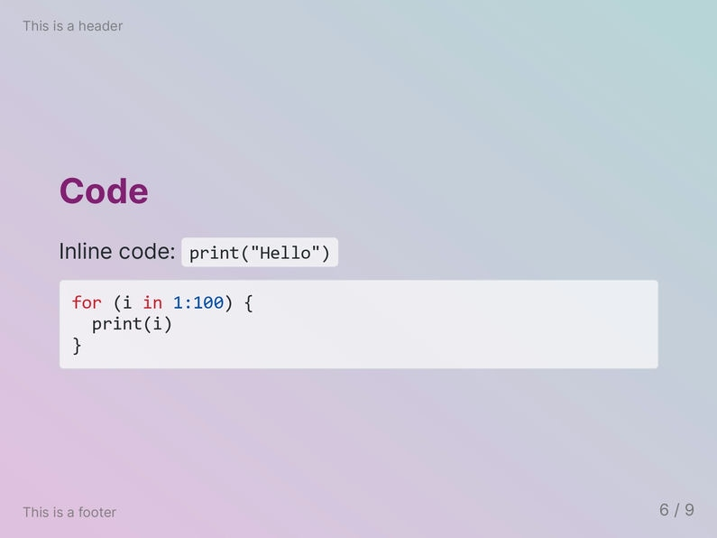
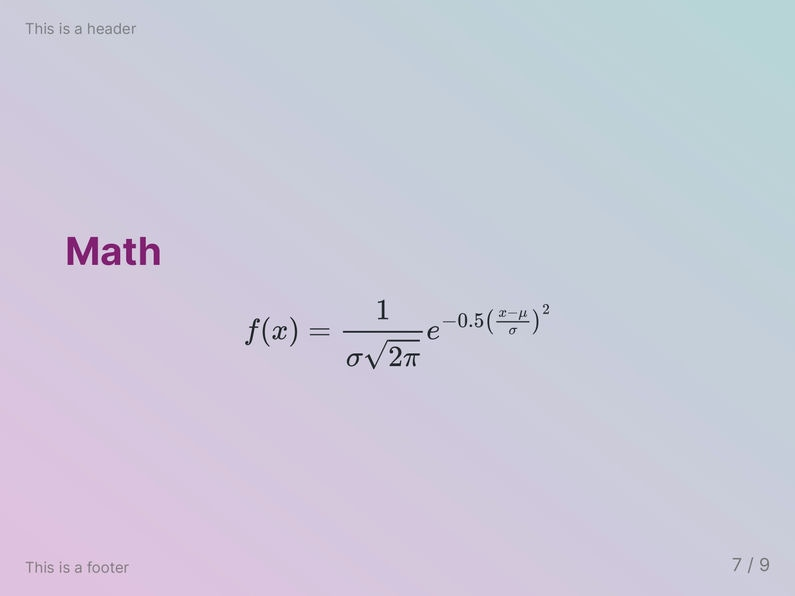
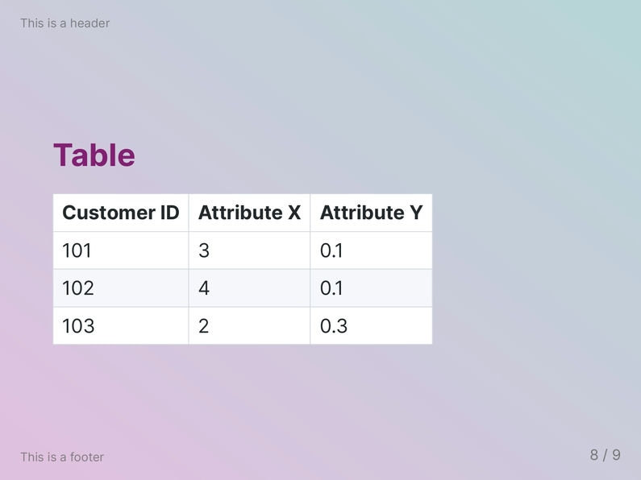
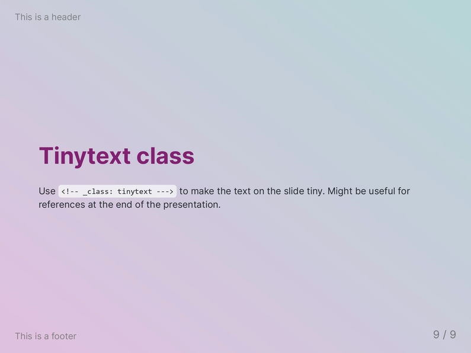

This theme is based on the `default` Marp theme. The background on each slide is a colorful diagonal gradient—either shades of blue or pink to light green. As the main font, the [Inter](https://github.com/rsms/inter) font family is used.

# Screenshots

## `class: blue`

## `class: default`

# Custom classes and keywords

`<!-- _class: tinytext -->`

- Makes most text on the slide much smaller.
- Might be useful for references.

``

- By default, images are left-aligned.
- The `center` keywords centers the image.

`<!-- _class: blue -->`

- Blue variant of the `gradient` theme.

# License

This theme is licensed under the [MIT License](https://github.com/rnd195/my-marp-themes/blob/live/LICENSE).