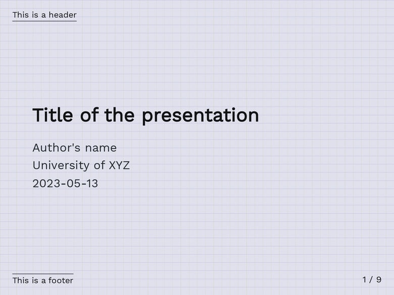
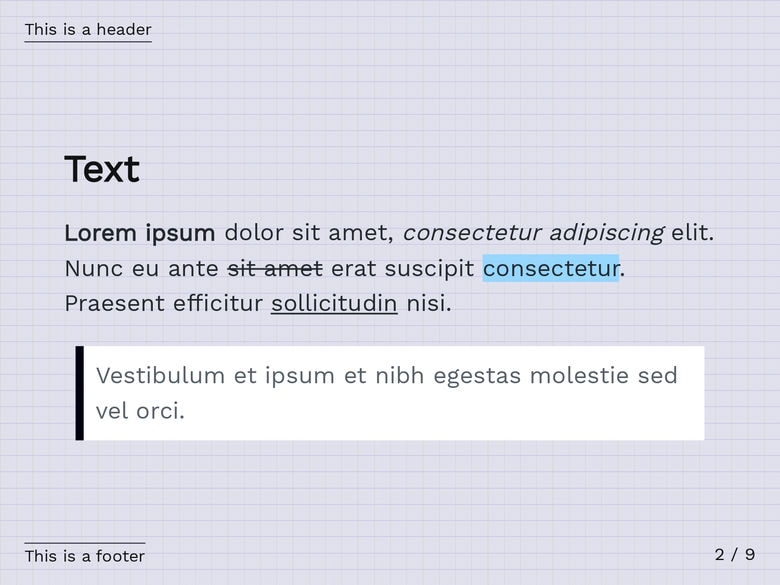
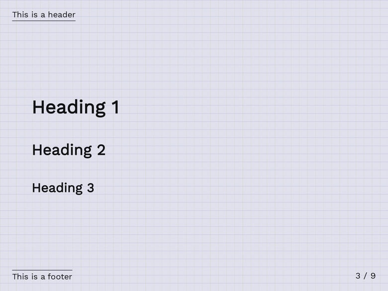
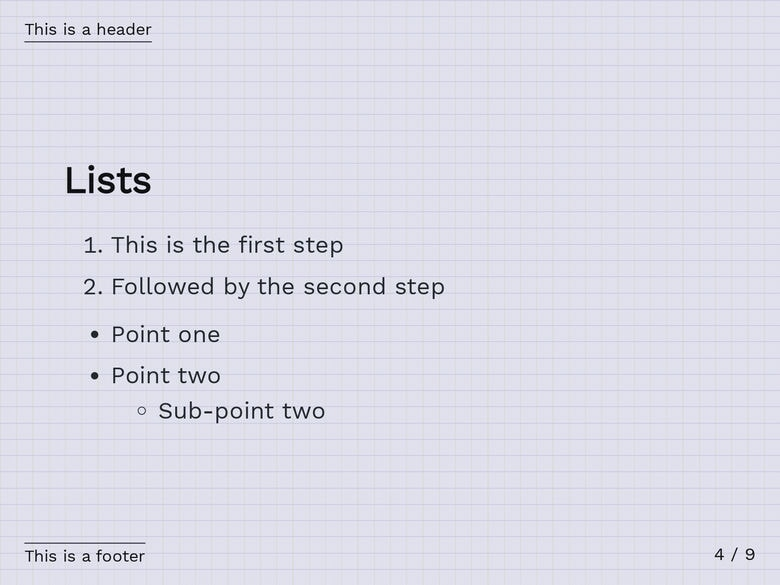
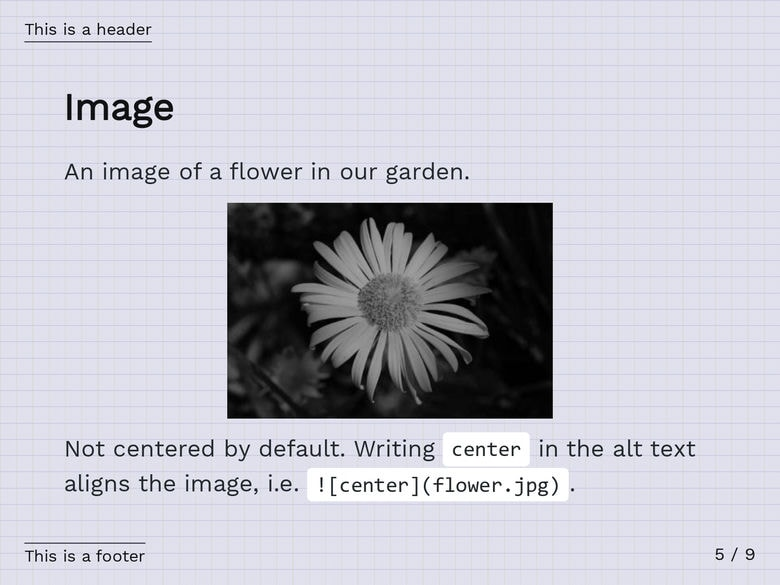
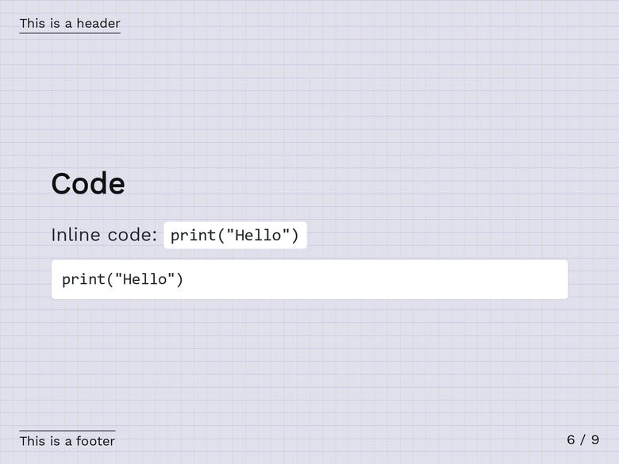
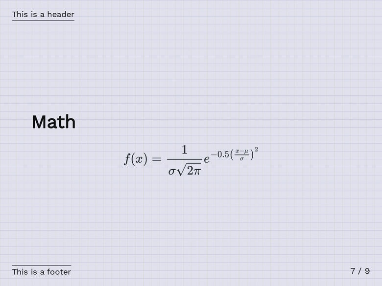
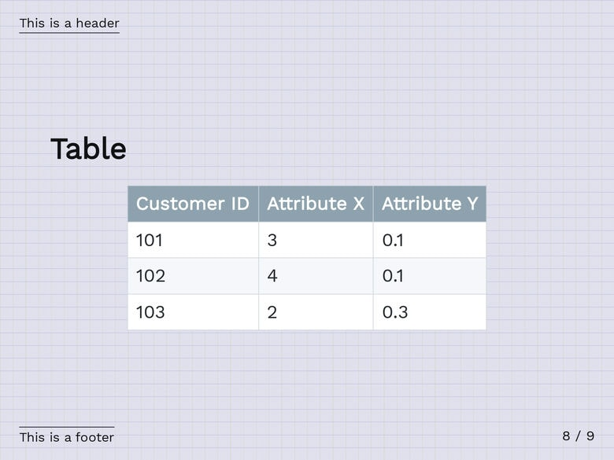
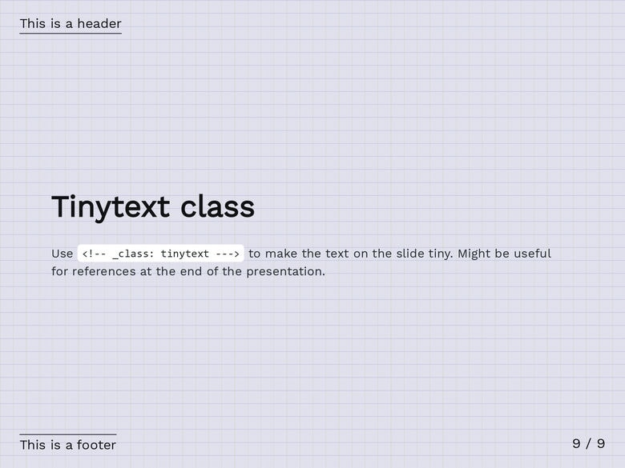

The `graph_paper` theme features a subtle graph paper-like background with dark text mixed with white elements (e.g., code blocks or block quotes). The [Work Sans](https://github.com/weiweihuanghuang/Work-Sans) font family is imported and utilized to enhance the visual appeal and readability of the text.

# Screenshots

# Custom classes and keywords

`<!-- _class: tinytext -->`

- Makes most text on the slide much smaller.
- Might be useful for references.

``

- By default, images are left-aligned.
- The `center` keywords centers the image.

The tables are centered by default.

# License

This theme is licensed under the [MIT License](https://github.com/rnd195/my-marp-themes/blob/live/LICENSE).