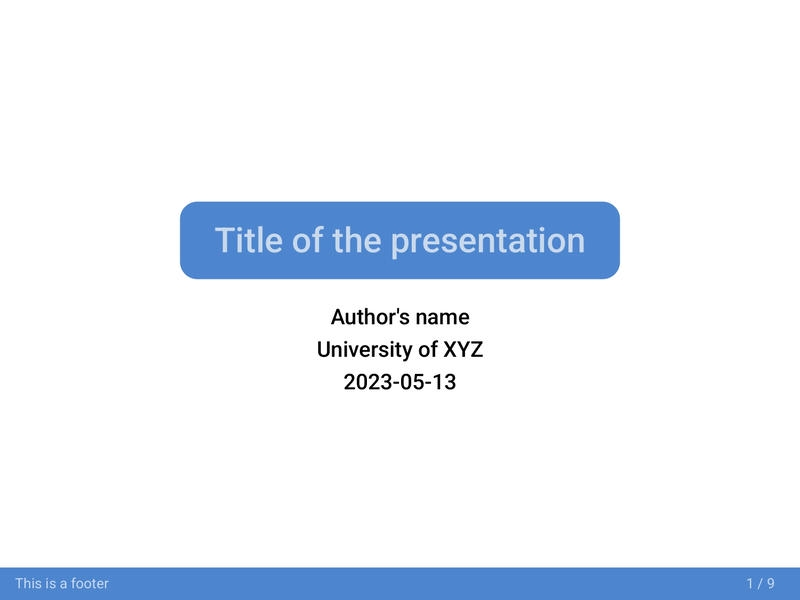
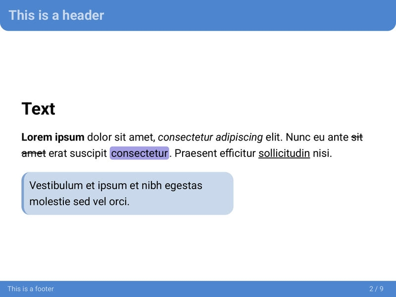
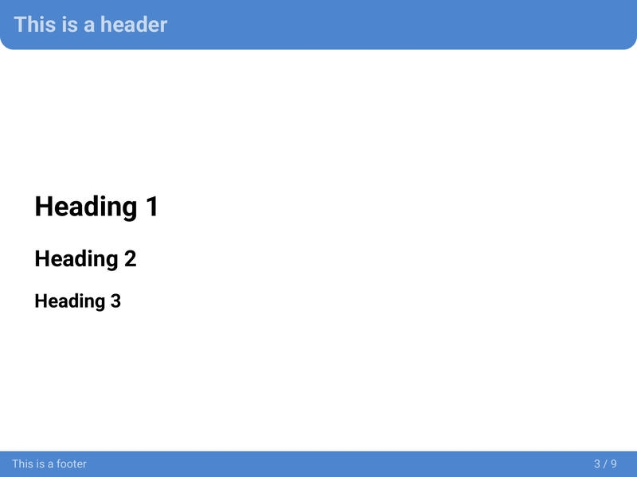
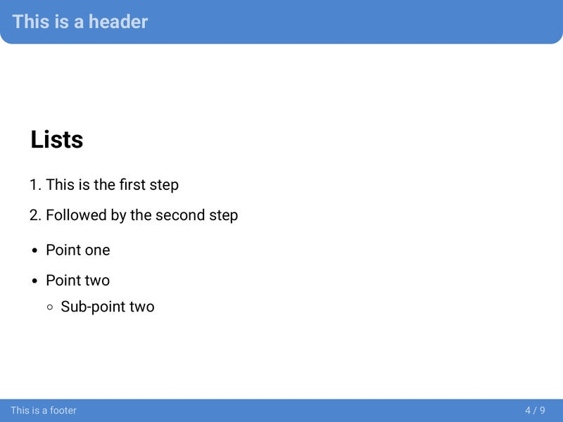
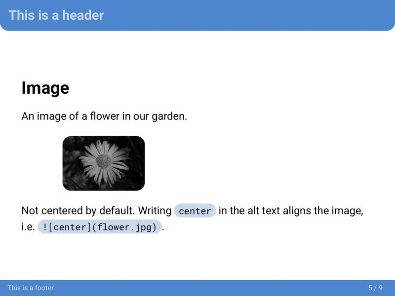
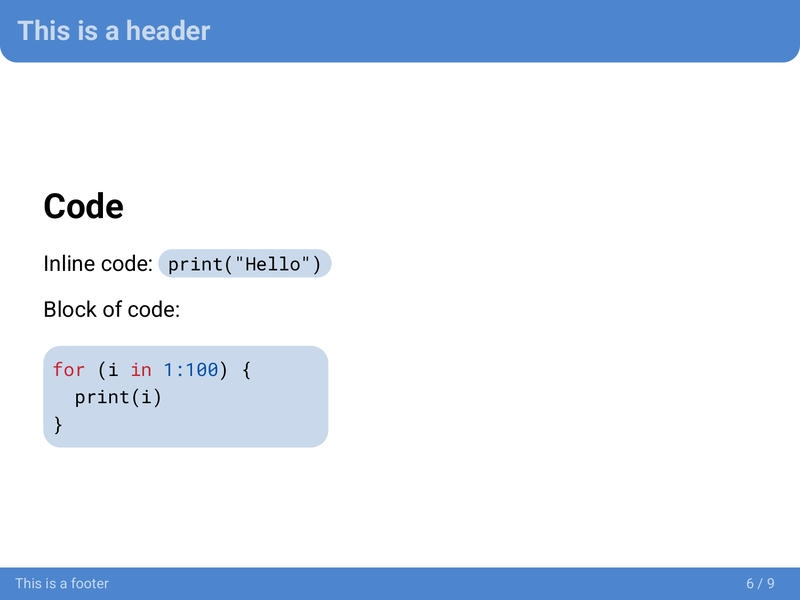
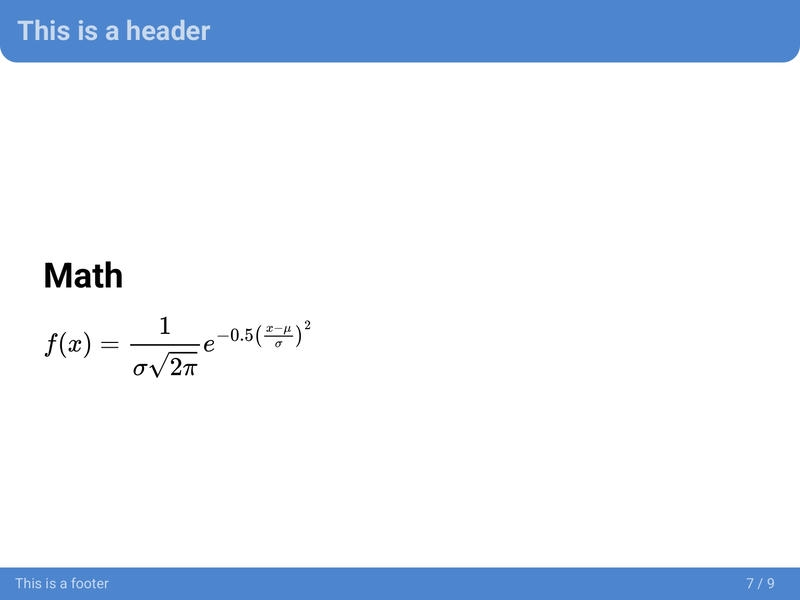
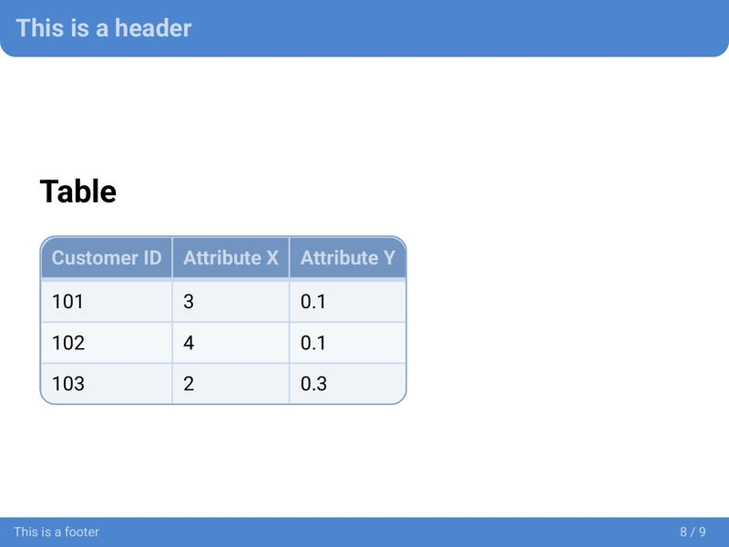
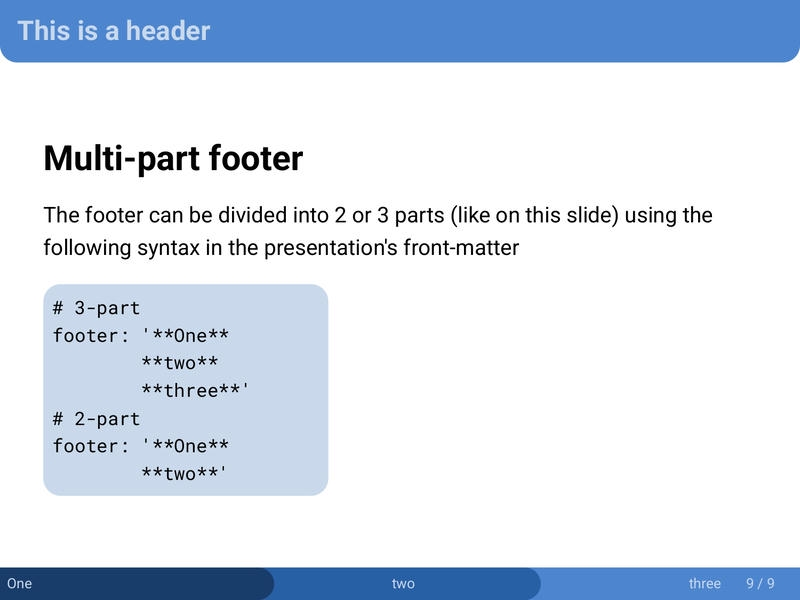

The `neobeam` theme is a modern take on the LaTeX beamer. It contains several color variants and custom syntax for features such as a title page or a three-part footer.

If you like the `neobeam` theme and wish to show support to the author(s), please consider [starring the theme's GitHub repository](https://github.com/mikael-ros/neobeam)!

# Screenshots



- `<!-- _class: title -->` needs to be specified for the first slide to look like this. Here is an example of what that could look like

```
---
marp: true
theme: beam
---
<!-- _class: title -->
<!-- _header: "" -->
# Title of the presentation
Author's name
University of XYZ
2023-05-13
```


















## Theme variants

Click each theme name to get its CSS file. Please note that the base `neobeam` theme is required for these variants to work.

::: {layout-ncol=2}
](neobeam.assets/neobeam-beamer.jpg)

](neobeam.assets/neobeam-csek.jpg)

](neobeam.assets/neobeam-dsek.jpg)

](neobeam.assets/neobeam-ecobeam.jpg)

](neobeam.assets/neobeam-embracket.jpg)

](neobeam.assets/neobeam-lund.jpg)

](neobeam.assets/neobeam-neonbeam.jpg) 

](neobeam.assets/neobeam-oldenbeam.jpg) 

:::

# Custom classes and keywords

`<!-- _class: title -->`

- Changes the layout of the slide to a title page.
- The first Heading 1 will be styled as the title.
- Make sure to include the underscore “_” so that your whole presentation is not made up of title pages.
- Use `<!-- _header: "" -->` to disable the header on the title page.

`Multi-part footer`

The footer can be divided into 2 or 3 parts using the following syntax in the presentation's front-matter

```
# 3-part
footer: '**One**
        **two**
        **three**'
# 2-part
footer: '**One**
        **two**'
```

``

- By default, images are left-aligned.
- The `center` keywords centers the image.

# Privacy notice

Please, be aware that by using this CSS theme you import fonts from the Google Fonts service. Refer to their [Privacy FAQ](https://developers.google.com/fonts/faq/privacy) for more information about using their service.

# License

This theme is licensed under the [MIT License](https://github.com/mikael-ros/neobeam/blob/main/LICENSE).