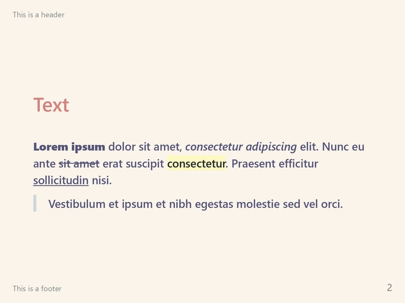
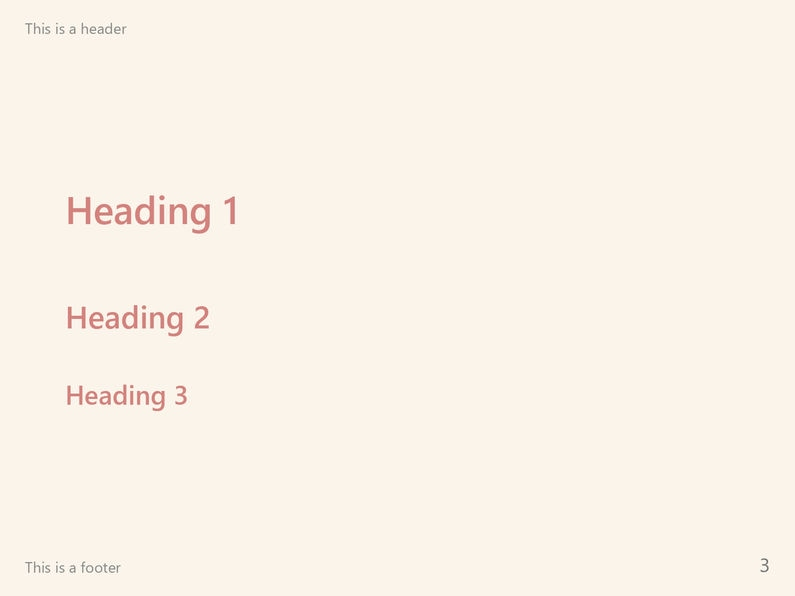
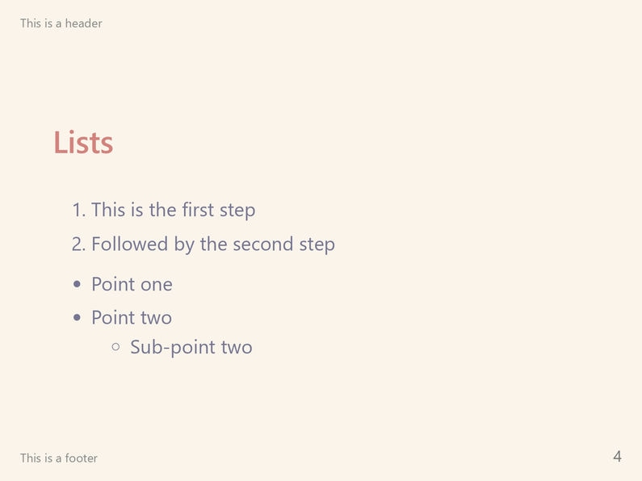
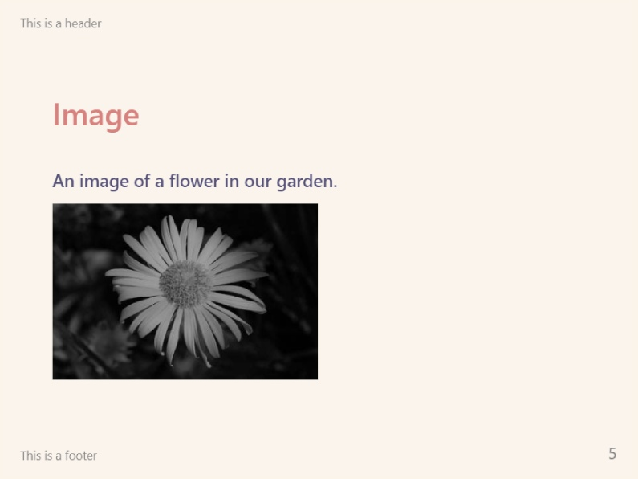
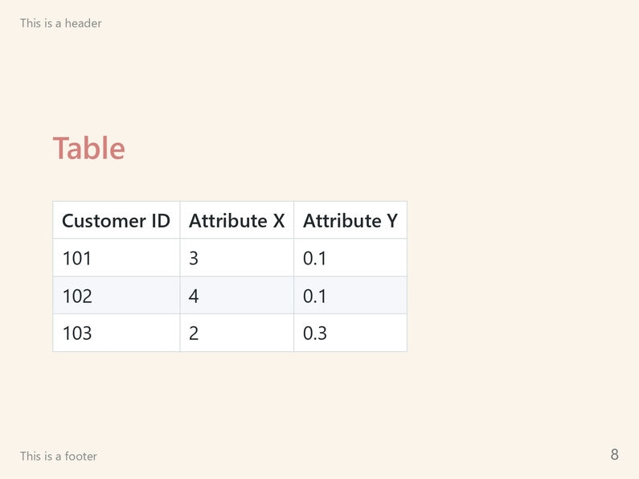

This theme implements the Dawn variant of the [Rosé Pine](https://rosepinetheme.com/) color palette for Marp. It features soft natural colors with a light background and illustrates that familiar feeling of a waking up early on a sunny day.

If you like the `rose-pine-dawn` theme and wish to show support to the author(s), please consider [starring the theme's GitHub repository](https://github.com/rainbowflesh/Rose-Pine-For-Marp)!

# Screenshots

# License

This theme is licensed under the [MIT License](https://github.com/rainbowflesh/Rose-Pine-For-Marp/blob/master/license).