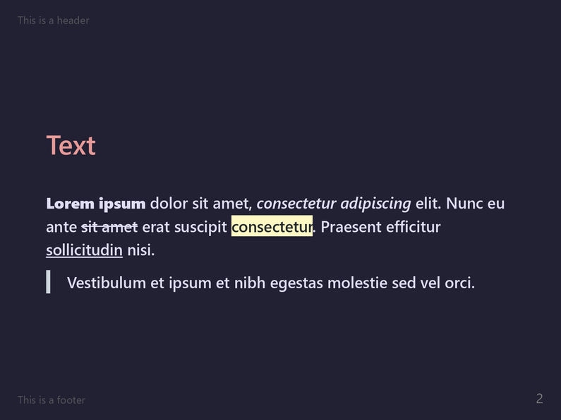
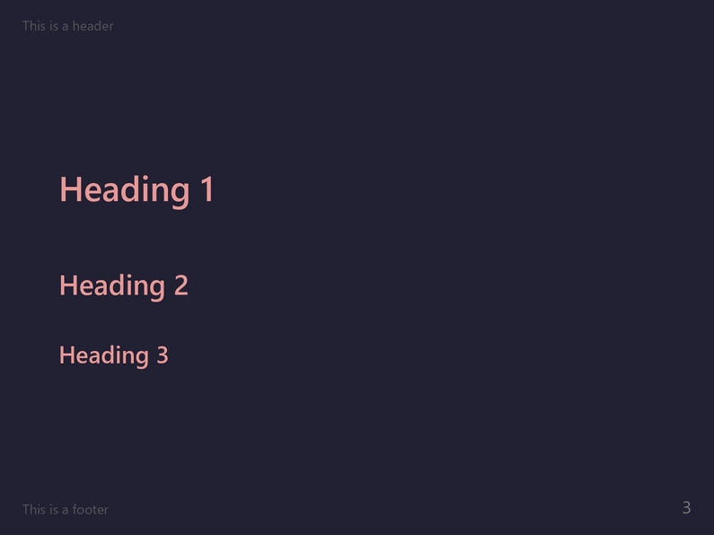
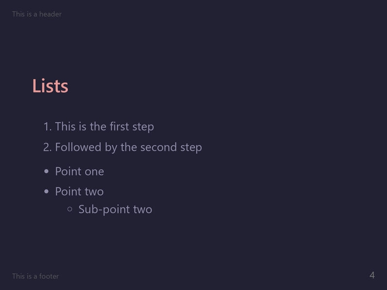
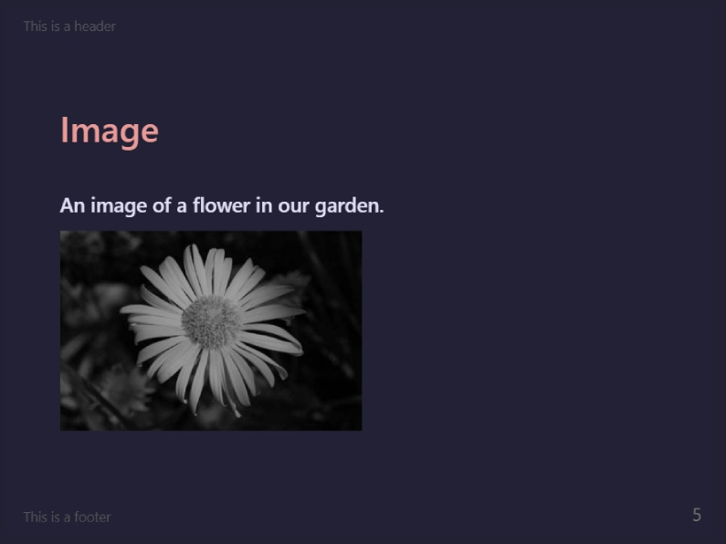
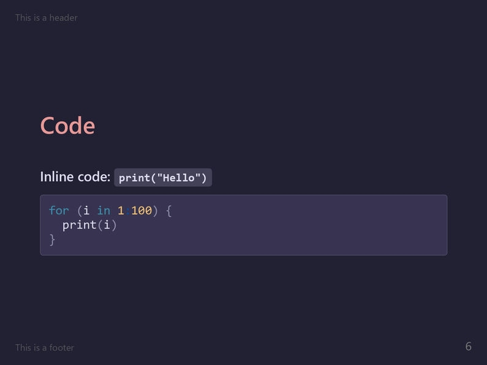
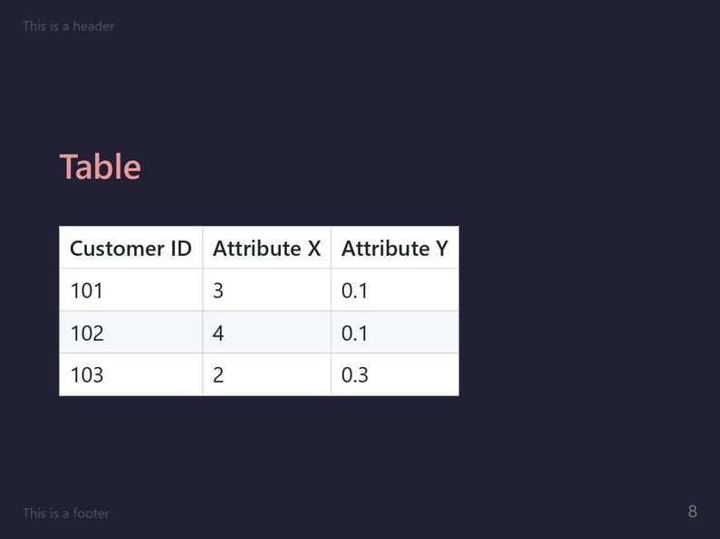

This theme implements the Moon variant of the [Rosé Pine](https://rosepinetheme.com/) color palette for Marp. It features a dark background with soft natural colors illuminating the slide much like a tapestry of neon hues on an empty city street at night.

If you like the `rose-pine-moon` theme and wish to show support to the author(s), please consider [starring the theme's GitHub repository](https://github.com/rainbowflesh/Rose-Pine-For-Marp)!

# Screenshots

# License

This theme is licensed under the [MIT License](https://github.com/rainbowflesh/Rose-Pine-For-Marp/blob/master/license).