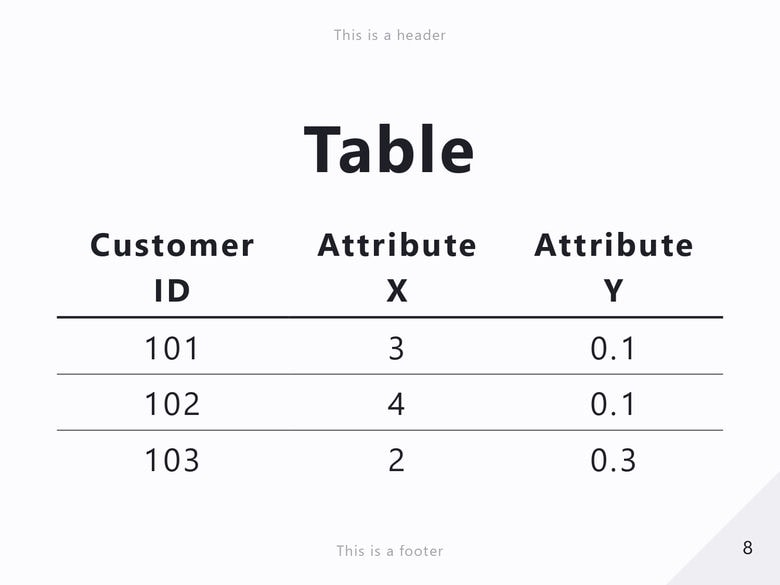

Uncover is a built-in theme in Marp featuring a stylish black and white color palette with centered elements.

# Screenshots

## `class: invert`

## `class: default`

# Custom classes and keywords

`<!-- _class: invert -->`

- Color-inverted variant of the theme.

# License

This theme is licensed under the [MIT License](https://github.com/marp-team/marp/blob/main/LICENSE).