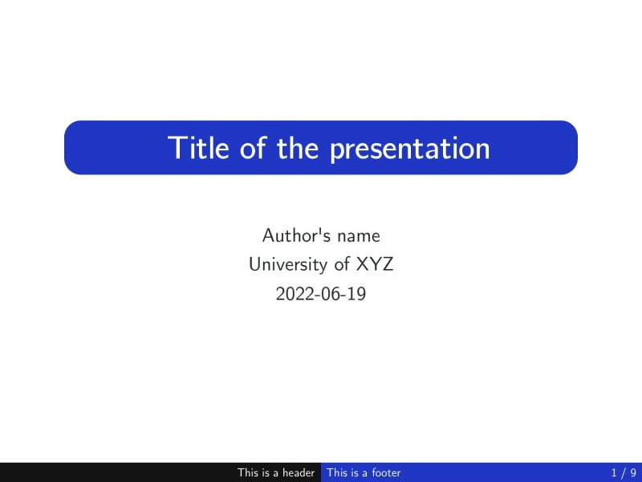
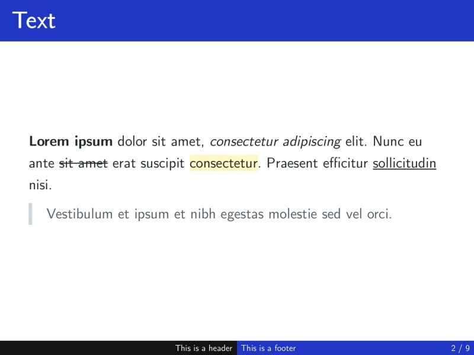
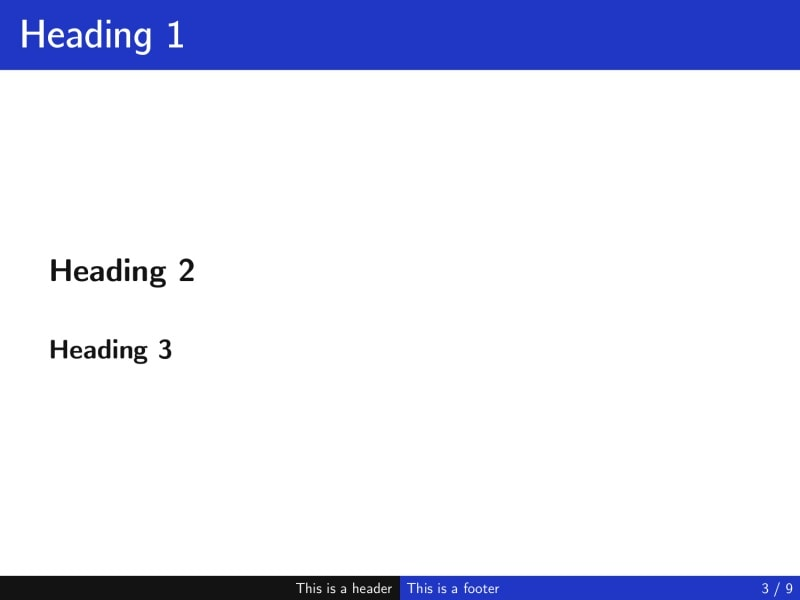
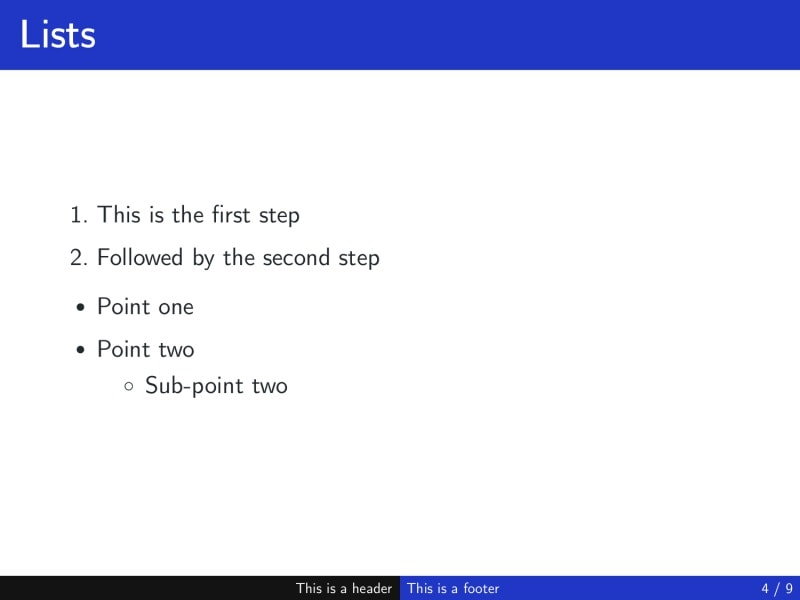
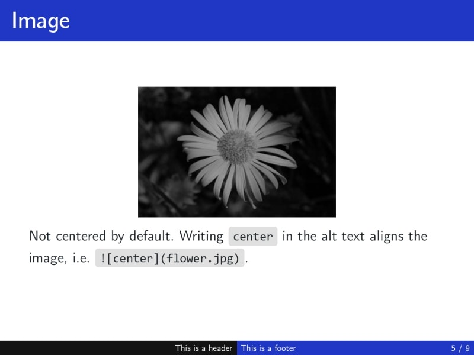
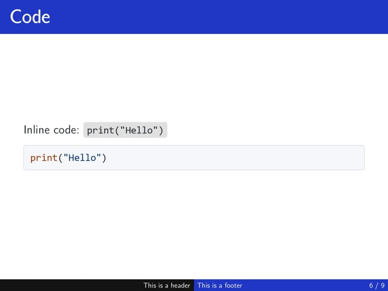
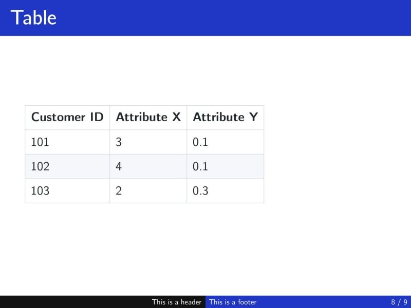
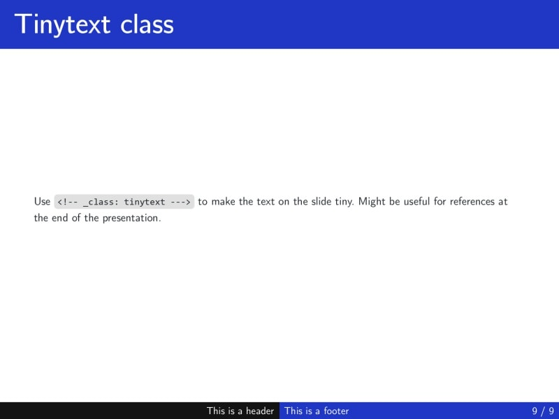

The `beam` theme *tries* to mimic the look of LaTeX's `beamer` class. As such, it is intended to be used with the [Computer Modern Unicode font family](https://ctan.org/pkg/cm-unicode?lang=en). It also provides support for a title page. To change the default colors from blue to anything else, please, follow the guide in the [Github repository](https://github.com/rnd195/my-marp-themes/blob/live/how-to/beam_custom.md) of the theme.

# Screenshots



- `<!-- _class: title -->` needs to be specified for the first slide to look like this. Here is an example of what it could look like

```
---
marp: true
theme: beam
---
<!-- _class: title -->

# Title of the presentation

Author's name
University of XYZ
2022-06-19
```

















# Custom classes and keywords

`<!-- _class: title -->`

- Changes the layout of the slide to a title page.
- **The first Heading 1 will be styled as the title.**
- Make sure to include the underscore "_" so that your whole presentation is not made up of title pages.
- The title should be no more than 2 lines long, otherwise, it spills over other text.

`<!-- _class: tinytext -->`

- Makes most text on the slide much smaller.
- Might be useful for references.

``

- By default, images are left-aligned.
- The `center` keywords centers the image.

# License

The `beamer`-inspired `beam` theme is licensed under [GNU GPLv3](https://github.com/rnd195/my-marp-themes/blob/live/LICENSE_beam).
